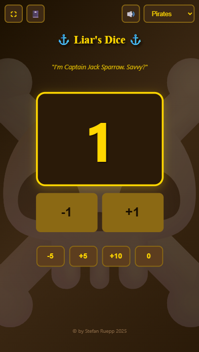

# Liar's Dice Counter

A simple, themed dice counter app for tracking dice in Liar's Dice games.

## Features

- **Multiple Themes** - Pirates, Mario, Kraken, Dutchman, and more
- **Quick Controls** - +1/-1 buttons for easy counting
- **Bulk Actions** - +5, +10, -5, and reset buttons
- **Sound Effects** - Theme-specific sounds for alerts and victories
- **Fullscreen Mode** - Distraction-free gameplay with screen wake lock
- **Mobile Friendly** - Works on any device

## Usage

1. Open `index.html` in your browser
2. Select a theme from the dropdown
3. Use the buttons to track your dice count
4. Reach 0 dice to trigger the victory celebration!

## Themes

Each theme includes unique:
- Visual styling and colors
- Background elements
- Sound effects
- Victory animations
- Themed quotes

## License

© Stefan Ruepp 2025
